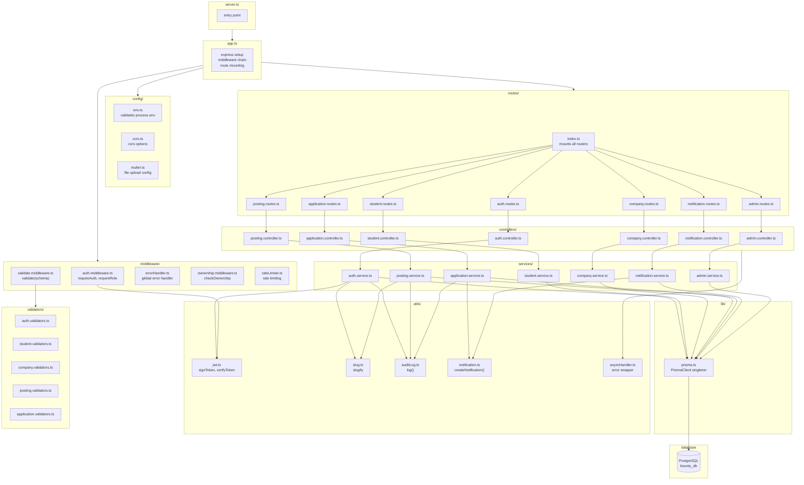

## Package Diagram of the Backend


```mermaid
graph TD
    subgraph server["server.ts"]
        entry["entry point"]
    end

    subgraph app["app.ts"]
        express["express setup\nmiddleware chain\nroute mounting"]
    end

    subgraph config["config/"]
        env["env.ts\nvalidates process.env"]
        cors["cors.ts\ncors options"]
        multer["multer.ts\nfile upload config"]
    end

    subgraph lib["lib/"]
        prisma["prisma.ts\nPrismaClient singleton"]
    end

    subgraph utils["utils/"]
        jwt["jwt.ts\nsignToken, verifyToken"]
        slug["slug.ts\nslugify"]
        audit["auditLog.ts\nlog()"]
        notif["notification.ts\ncreateNotification()"]
        async["asyncHandler.ts\nerror wrapper"]
    end

    subgraph middleware["middleware/"]
        authM["auth.middleware.ts\nrequireAuth, requireRole"]
        validate["validate.middleware.ts\nvalidate(schema)"]
        error["errorHandler.ts\nglobal error handler"]
        ownership["ownership.middleware.ts\ncheckOwnership"]
        rate["rateLimiter.ts\nrate limiting"]
    end

    subgraph validators["validators/"]
        authV["auth.validators.ts"]
        studentV["student.validators.ts"]
        companyV["company.validators.ts"]
        postingV["posting.validators.ts"]
        applicationV["application.validators.ts"]
    end

    subgraph routes["routes/"]
        index["index.ts\nmounts all routers"]
        authR["auth.routes.ts"]
        studentR["student.routes.ts"]
        companyR["company.routes.ts"]
        postingR["posting.routes.ts"]
        applicationR["application.routes.ts"]
        notificationR["notification.routes.ts"]
        adminR["admin.routes.ts"]
    end

    subgraph controllers["controllers/"]
        authC["auth.controller.ts"]
        studentC["student.controller.ts"]
        companyC["company.controller.ts"]
        postingC["posting.controller.ts"]
        applicationC["application.controller.ts"]
        notificationC["notification.controller.ts"]
        adminC["admin.controller.ts"]
    end

    subgraph services["services/"]
        authS["auth.service.ts"]
        studentS["student.service.ts"]
        companyS["company.service.ts"]
        postingS["posting.service.ts"]
        applicationS["application.service.ts"]
        notificationS["notification.service.ts"]
        adminS["admin.service.ts"]
    end

    subgraph database["database"]
        pg[("PostgreSQL\nbounty_db")]
    end

    %% top level flow
    server --> app
    app --> config
    app --> middleware
    app --> routes

    %% routes → controllers
    index --> authR & studentR & companyR & postingR
    index --> applicationR & notificationR & adminR

    authR --> authC
    studentR --> studentC
    companyR --> companyC
    postingR --> postingC
    applicationR --> applicationC
    notificationR --> notificationC
    adminR --> adminC

    %% controllers → services
    authC --> authS
    studentC --> studentS
    companyC --> companyS
    postingC --> postingS
    applicationC --> applicationS
    notificationC --> notificationS
    adminC --> adminS

    %% services → prisma → db
    authS & studentS & companyS & postingS --> prisma
    applicationS & notificationS & adminS --> prisma
    prisma --> pg

    %% shared utils
    authS --> jwt & slug & audit
    postingS --> slug & audit
    applicationS --> audit & notif
    notificationS --> notif

    %% middleware deps
    authM --> jwt
    validate --> validators
    controllers --> async
```

```

```

