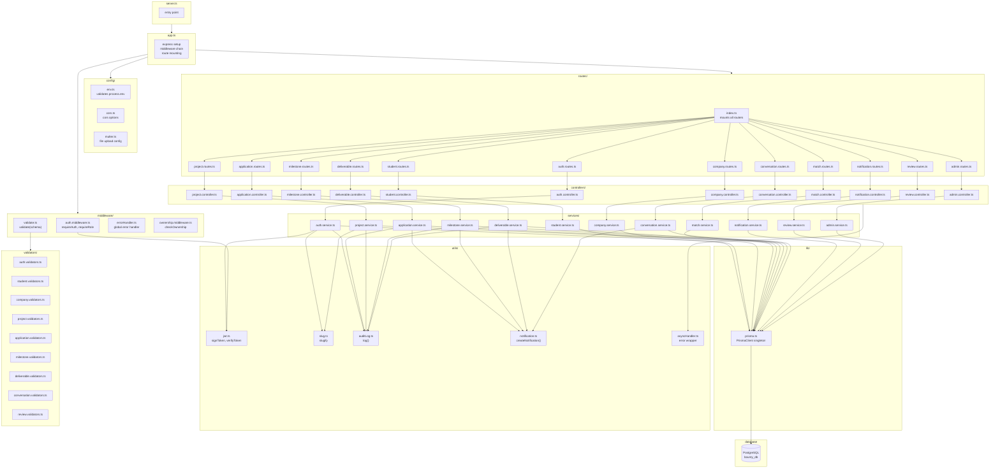

## Paquetage Diagram of the backend

```mermaid
graph TD
    subgraph server["server.ts"]
        entry["entry point"]
    end

    subgraph app["app.ts"]
        express["express setup\nmiddleware chain\nroute mounting"]
    end

    subgraph config["config/"]
        env["env.ts\nvalidates process.env"]
        cors["cors.ts\ncors options"]
        multer["multer.ts\nfile upload config"]
    end

    subgraph lib["lib/"]
        prisma["prisma.ts\nPrismaClient singleton"]
    end

    subgraph utils["utils/"]
        jwt["jwt.ts\nsignToken, verifyToken"]
        slug["slug.ts\nslugify"]
        audit["auditLog.ts\nlog()"]
        notif["notification.ts\ncreateNotification()"]
        async["asyncHandler.ts\nerror wrapper"]
    end

    subgraph middleware["middleware/"]
        auth["auth.middleware.ts\nrequireAuth, requireRole"]
        validate["validate.ts\nvalidate(schema)"]
        error["errorHandler.ts\nglobal error handler"]
        ownership["ownership.middleware.ts\ncheckOwnership"]
    end

    subgraph validators["validators/"]
        authV["auth.validators.ts"]
        studentV["student.validators.ts"]
        companyV["company.validators.ts"]
        projectV["project.validators.ts"]
        applicationV["application.validators.ts"]
        milestoneV["milestone.validators.ts"]
        deliverableV["deliverable.validators.ts"]
        conversationV["conversation.validators.ts"]
        reviewV["review.validators.ts"]
    end

    subgraph routes["routes/"]
        index["index.ts\nmounts all routers"]
        authR["auth.routes.ts"]
        studentR["student.routes.ts"]
        companyR["company.routes.ts"]
        projectR["project.routes.ts"]
        applicationR["application.routes.ts"]
        matchR["match.routes.ts"]
        milestoneR["milestone.routes.ts"]
        deliverableR["deliverable.routes.ts"]
        conversationR["conversation.routes.ts"]
        notificationR["notification.routes.ts"]
        reviewR["review.routes.ts"]
        adminR["admin.routes.ts"]
    end

    subgraph controllers["controllers/"]
        authC["auth.controller.ts"]
        studentC["student.controller.ts"]
        companyC["company.controller.ts"]
        projectC["project.controller.ts"]
        applicationC["application.controller.ts"]
        matchC["match.controller.ts"]
        milestoneC["milestone.controller.ts"]
        deliverableC["deliverable.controller.ts"]
        conversationC["conversation.controller.ts"]
        notificationC["notification.controller.ts"]
        reviewC["review.controller.ts"]
        adminC["admin.controller.ts"]
    end

    subgraph services["services/"]
        authS["auth.service.ts"]
        studentS["student.service.ts"]
        companyS["company.service.ts"]
        projectS["project.service.ts"]
        applicationS["application.service.ts"]
        matchS["match.service.ts"]
        milestoneS["milestone.service.ts"]
        deliverableS["deliverable.service.ts"]
        conversationS["conversation.service.ts"]
        notificationS["notification.service.ts"]
        reviewS["review.service.ts"]
        adminS["admin.service.ts"]
    end

    subgraph database["database"]
        pg[("PostgreSQL\nbounty_db")]
    end

%% top level flow
server --> app
app --> config
app --> middleware
app --> routes

%% routes → controllers
index --> authR & studentR & companyR & projectR
index --> applicationR & matchR & milestoneR & deliverableR
index --> conversationR & notificationR & reviewR & adminR

authR --> authC
studentR --> studentC
companyR --> companyC
projectR --> projectC
applicationR --> applicationC
matchR --> matchC
milestoneR --> milestoneC
deliverableR --> deliverableC
conversationR --> conversationC
notificationR --> notificationC
reviewR --> reviewC
adminR --> adminC

%% controllers → services
authC --> authS
studentC --> studentS
companyC --> companyS
projectC --> projectS
applicationC --> applicationS
matchC --> matchS
milestoneC --> milestoneS
deliverableC --> deliverableS
conversationC --> conversationS
notificationC --> notificationS
reviewC --> reviewS
adminC --> adminS

%% services → prisma → db
authS & studentS & companyS & projectS --> prisma
applicationS & matchS & milestoneS & deliverableS --> prisma
conversationS & notificationS & reviewS & adminS --> prisma
prisma --> pg

%% shared utils used by services
authS --> jwt & slug & audit
applicationS --> audit & notif
projectS --> slug & audit
milestoneS --> notif & audit
deliverableS --> notif & audit
conversationS --> notif

%% middleware deps
auth --> jwt
validate --> validators
controllers --> async
```