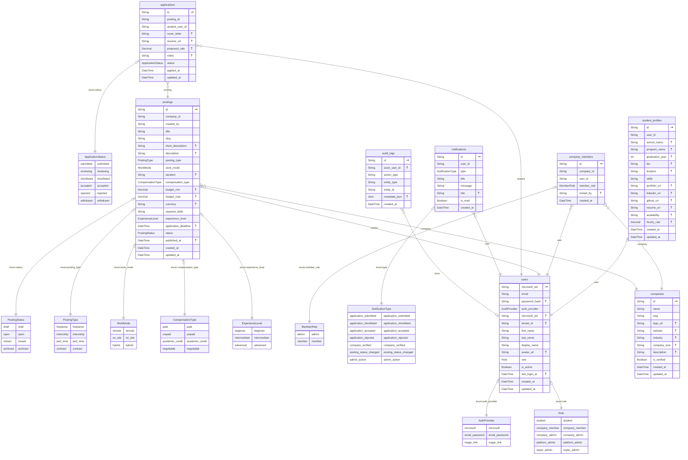

```mermaid
erDiagram

        Role {
            student student
company_member company_member
company_admin company_admin
platform_admin platform_admin
super_admin super_admin
        }
    


        AuthProvider {
            microsoft microsoft
email_password email_password
magic_link magic_link
        }
    


        PostingStatus {
            draft draft
open open
closed closed
archived archived
        }
    


        PostingType {
            freelance freelance
internship internship
part_time part_time
contract contract
        }
    


        WorkMode {
            remote remote
on_site on_site
hybrid hybrid
        }
    


        CompensationType {
            paid paid
unpaid unpaid
academic_credit academic_credit
negotiable negotiable
        }
    


        ExperienceLevel {
            beginner beginner
intermediate intermediate
advanced advanced
        }
    


        ApplicationStatus {
            submitted submitted
reviewing reviewing
shortlisted shortlisted
accepted accepted
rejected rejected
withdrawn withdrawn
        }
    


        MemberRole {
            admin admin
member member
        }
    


        NotificationType {
            application_submitted application_submitted
application_shortlisted application_shortlisted
application_accepted application_accepted
application_rejected application_rejected
company_verified company_verified
posting_status_changed posting_status_changed
admin_action admin_action
        }
    
  "users" {
    String microsoft_oid "🗝️"
    String email 
    String password_hash "❓"
    AuthProvider auth_provider 
    String microsoft_oid "❓"
    String tenant_id "❓"
    String first_name 
    String last_name 
    String display_name 
    String avatar_url "❓"
    Role role 
    Boolean is_active 
    DateTime last_login_at "❓"
    DateTime created_at 
    DateTime updated_at 
    }
  

  "student_profiles" {
    String id "🗝️"
    String user_id 
    String school_name "❓"
    String program_name "❓"
    Int graduation_year "❓"
    String bio "❓"
    String location "❓"
    String skills 
    String portfolio_url "❓"
    String linkedin_url "❓"
    String github_url "❓"
    String resume_url "❓"
    String availability "❓"
    Decimal hourly_rate "❓"
    DateTime created_at 
    DateTime updated_at 
    }
  

  "companies" {
    String id "🗝️"
    String name 
    String slug 
    String logo_url "❓"
    String website "❓"
    String industry "❓"
    String company_size "❓"
    String description "❓"
    Boolean is_verified 
    DateTime created_at 
    DateTime updated_at 
    }
  

  "company_members" {
    String id "🗝️"
    String company_id 
    String user_id 
    MemberRole member_role 
    String invited_by "❓"
    DateTime created_at 
    }
  

  "postings" {
    String id "🗝️"
    String company_id 
    String created_by 
    String title 
    String slug 
    String short_description "❓"
    String description "❓"
    PostingType posting_type 
    WorkMode work_mode 
    String duration "❓"
    CompensationType compensation_type 
    Decimal budget_min "❓"
    Decimal budget_max "❓"
    String currency "❓"
    String required_skills 
    ExperienceLevel experience_level 
    DateTime application_deadline "❓"
    PostingStatus status 
    DateTime published_at "❓"
    DateTime created_at 
    DateTime updated_at 
    }
  

  "applications" {
    String id "🗝️"
    String posting_id 
    String student_user_id 
    String cover_letter "❓"
    String resume_url "❓"
    Decimal proposed_rate "❓"
    String notes "❓"
    ApplicationStatus status 
    DateTime applied_at 
    DateTime updated_at 
    }
  

  "notifications" {
    String id "🗝️"
    String user_id 
    NotificationType type 
    String title 
    String message 
    String link "❓"
    Boolean is_read 
    DateTime created_at 
    }
  

  "audit_logs" {
    String id "🗝️"
    String actor_user_id "❓"
    String action_type 
    String entity_type 
    String entity_id 
    Json metadata_json "❓"
    DateTime created_at 
    }
  
    "users" |o--|| "AuthProvider" : "enum:auth_provider"
    "users" |o--|| "Role" : "enum:role"
    "student_profiles" |o--|| users : "user"
    "company_members" |o--|| "MemberRole" : "enum:member_role"
    "company_members" }o--|| companies : "company"
    "company_members" }o--|| users : "user"
    "postings" |o--|| "PostingType" : "enum:posting_type"
    "postings" |o--|| "WorkMode" : "enum:work_mode"
    "postings" |o--|| "CompensationType" : "enum:compensation_type"
    "postings" |o--|| "ExperienceLevel" : "enum:experience_level"
    "postings" |o--|| "PostingStatus" : "enum:status"
    "postings" }o--|| companies : "company"
    "postings" }o--|| users : "creator"
    "applications" |o--|| "ApplicationStatus" : "enum:status"
    "applications" }o--|| postings : "posting"
    "applications" }o--|| users : "student"
    "notifications" |o--|| "NotificationType" : "enum:type"
    "notifications" }o--|| users : "user"
    "audit_logs" }o--|o users : "actor"
```
