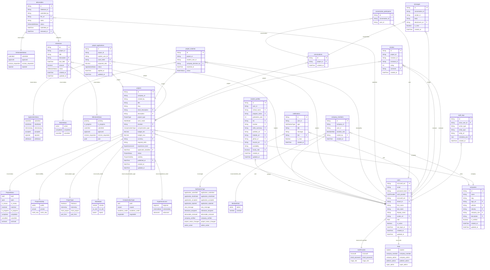

```mermaid
erDiagram

        Role {
            student student
company_member company_member
company_admin company_admin
platform_admin platform_admin
super_admin super_admin
        }
    


        AuthProvider {
            microsoft microsoft
email_password email_password
magic_link magic_link
        }
    


        ProjectStatus {
            draft draft
open open
in_review in_review
matched matched
in_progress in_progress
completed completed
cancelled cancelled
archived archived
        }
    


        ProjectVisibility {
            public public
private private
invite_only invite_only
        }
    


        ProjectType {
            freelance freelance
internship internship
short_project short_project
part_time part_time
        }
    


        WorkMode {
            remote remote
on_site on_site
hybrid hybrid
        }
    


        CompensationType {
            paid paid
unpaid unpaid
academic_credit academic_credit
negotiable negotiable
        }
    


        ExperienceLevel {
            beginner beginner
intermediate intermediate
advanced advanced
        }
    


        ApplicationStatus {
            submitted submitted
shortlisted shortlisted
interviewing interviewing
accepted accepted
rejected rejected
withdrawn withdrawn
        }
    


        MatchStatus {
            active active
completed completed
cancelled cancelled
        }
    


        MilestoneStatus {
            pending pending
in_progress in_progress
submitted submitted
approved approved
revision_requested revision_requested
paid paid
        }
    


        DeliverableStatus {
            submitted submitted
approved approved
revision_requested revision_requested
rejected rejected
        }
    


        NotificationType {
            application_submitted application_submitted
application_shortlisted application_shortlisted
application_accepted application_accepted
application_rejected application_rejected
new_message new_message
milestone_assigned milestone_assigned
deliverable_reviewed deliverable_reviewed
company_verified company_verified
project_status_changed project_status_changed
admin_action admin_action
        }
    


        MemberRole {
            admin admin
member member
        }
    
  "users" {
    String microsoft_oid "🗝️"
    String email 
    String password_hash "❓"
    AuthProvider auth_provider 
    String microsoft_oid "❓"
    String tenant_id "❓"
    String first_name 
    String last_name 
    String display_name 
    String avatar_url "❓"
    Role role 
    Boolean is_active 
    DateTime last_login_at "❓"
    DateTime created_at 
    DateTime updated_at 
    }
  

  "student_profiles" {
    String id "🗝️"
    String user_id 
    String school_name "❓"
    String program_name "❓"
    Int graduation_year "❓"
    String bio "❓"
    String location "❓"
    String skills_summary "❓"
    String portfolio_url "❓"
    String linkedin_url "❓"
    String github_url "❓"
    String resume_url "❓"
    String availability "❓"
    Decimal hourly_rate "❓"
    DateTime created_at 
    DateTime updated_at 
    }
  

  "companies" {
    String id "🗝️"
    String name 
    String slug 
    String logo_url "❓"
    String website "❓"
    String industry "❓"
    String company_size "❓"
    String description "❓"
    Boolean is_verified 
    DateTime created_at 
    DateTime updated_at 
    }
  

  "company_members" {
    String id "🗝️"
    String company_id 
    String user_id 
    MemberRole member_role 
    String invited_by "❓"
    DateTime created_at 
    }
  

  "projects" {
    String id "🗝️"
    String company_id 
    String created_by 
    String title 
    String slug 
    String short_description "❓"
    String description "❓"
    ProjectType project_type 
    WorkMode work_mode 
    String duration "❓"
    CompensationType compensation_type 
    Decimal budget_min "❓"
    Decimal budget_max "❓"
    String currency "❓"
    String required_skills 
    ExperienceLevel experience_level 
    DateTime application_deadline "❓"
    ProjectStatus status 
    ProjectVisibility visibility 
    DateTime published_at "❓"
    DateTime created_at 
    DateTime updated_at 
    }
  

  "project_applications" {
    String id "🗝️"
    String project_id 
    String student_user_id 
    String cover_letter "❓"
    Decimal proposed_rate "❓"
    ApplicationStatus status 
    DateTime applied_at 
    DateTime updated_at 
    }
  

  "project_matches" {
    String id "🗝️"
    String project_id 
    String student_user_id 
    String company_decision_by "❓"
    DateTime matched_at 
    MatchStatus status 
    }
  

  "milestones" {
    String id "🗝️"
    String project_id 
    String title 
    String description "❓"
    DateTime due_date "❓"
    Decimal amount "❓"
    MilestoneStatus status 
    DateTime created_at 
    DateTime updated_at 
    }
  

  "deliverables" {
    String id "🗝️"
    String milestone_id 
    String submitted_by 
    String file_url "❓"
    String notes "❓"
    DeliverableStatus status 
    DateTime submitted_at 
    DateTime reviewed_at "❓"
    }
  

  "conversations" {
    String id "🗝️"
    String project_id "❓"
    DateTime created_at 
    }
  

  "conversation_participants" {
    String id "🗝️"
    String conversation_id 
    String user_id 
    }
  

  "messages" {
    String id "🗝️"
    String conversation_id 
    String sender_id 
    String body 
    String attachment_url "❓"
    Boolean is_read 
    DateTime created_at 
    }
  

  "notifications" {
    String id "🗝️"
    String user_id 
    NotificationType type 
    String title 
    String message 
    String link "❓"
    Boolean is_read 
    DateTime created_at 
    }
  

  "reviews" {
    String id "🗝️"
    String project_id 
    String reviewer_id 
    String reviewee_id 
    Int rating 
    String comment "❓"
    DateTime created_at 
    }
  

  "audit_logs" {
    String id "🗝️"
    String actor_user_id "❓"
    String action_type 
    String entity_type 
    String entity_id 
    Json metadata_json "❓"
    DateTime created_at 
    }
  
    "users" |o--|| "AuthProvider" : "enum:auth_provider"
    "users" |o--|| "Role" : "enum:role"
    "student_profiles" |o--|| users : "user"
    "company_members" |o--|| "MemberRole" : "enum:member_role"
    "company_members" }o--|| companies : "company"
    "company_members" }o--|| users : "user"
    "projects" |o--|| "ProjectType" : "enum:project_type"
    "projects" |o--|| "WorkMode" : "enum:work_mode"
    "projects" |o--|| "CompensationType" : "enum:compensation_type"
    "projects" |o--|| "ExperienceLevel" : "enum:experience_level"
    "projects" |o--|| "ProjectStatus" : "enum:status"
    "projects" |o--|| "ProjectVisibility" : "enum:visibility"
    "projects" }o--|| companies : "company"
    "projects" }o--|| users : "creator"
    "project_applications" |o--|| "ApplicationStatus" : "enum:status"
    "project_applications" }o--|| projects : "project"
    "project_applications" }o--|| users : "student"
    "project_matches" |o--|| "MatchStatus" : "enum:status"
    "project_matches" }o--|| projects : "project"
    "project_matches" }o--|| users : "student"
    "project_matches" }o--|o users : "decisionBy"
    "milestones" |o--|| "MilestoneStatus" : "enum:status"
    "milestones" }o--|| projects : "project"
    "deliverables" |o--|| "DeliverableStatus" : "enum:status"
    "deliverables" }o--|| milestones : "milestone"
    "deliverables" }o--|| users : "submitter"
    "conversations" }o--|o projects : "project"
    "conversation_participants" }o--|| conversations : "conversation"
    "conversation_participants" }o--|| users : "user"
    "messages" }o--|| conversations : "conversation"
    "messages" }o--|| users : "sender"
    "notifications" |o--|| "NotificationType" : "enum:type"
    "notifications" }o--|| users : "user"
    "reviews" }o--|| projects : "project"
    "reviews" }o--|| users : "reviewer"
    "reviews" }o--|| users : "reviewee"
    "audit_logs" }o--|o users : "actor"
```
