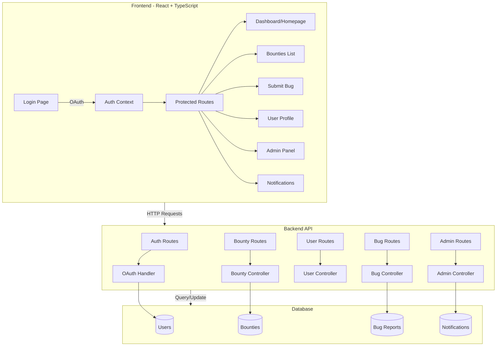

# Bug Bounty Website Development Plan

## Overview

Build a complete bug bounty platform for students with full-stack architecture, Microsoft OAuth authentication (restricted to school/education accounts only), and role-based access control (Student and Admin roles).

## Architecture



## Implementation Tasks

### Phase 1: Project Setup & Dependencies

#### 1.1 Install Frontend Dependencies

- Install React Router (`react-router-dom`) for routing
- Install Microsoft OAuth library (`@azure/msal-react` and `@azure/msal-browser` for Microsoft Authentication Library)
- Install HTTP client (`axios` or `fetch` wrapper)
- Install UI library (optional: `shadcn/ui`, `Material-UI`, or custom components)
- Install form handling (`react-hook-form` + `zod` for validation)
- Install state management (Context API or `zustand`)

#### 1.2 Install Backend Dependencies

- Set up backend framework (Node.js/Express or Python/Flask/FastAPI)
- Install Microsoft OAuth middleware:
  - For Node.js: `passport-azure-ad` or `@azure/msal-node`
  - For Python: `msal` (Microsoft Authentication Library)
- Install database ORM/ODM (Prisma, TypeORM, SQLAlchemy, or Mongoose)
- Install JWT library for token management
- Install CORS middleware
- Install environment variable management (`dotenv`)

#### 1.3 Database Setup

- Choose database (PostgreSQL, MySQL, or MongoDB)
- Design database schema:
  - Users table (id, email, name, role, oauth_provider, oauth_id, created_at)
  - Bounties table (id, title, description, difficulty, reward, status, created_by, created_at, updated_at)
  - Bug_Reports table (id, bounty_id, user_id, title, description, severity, status, submitted_at, reviewed_at)
  - Notifications table (id, user_id, type, message, read, created_at)
- Set up database connection and migrations

### Phase 2: Authentication System

#### 2.1 Microsoft OAuth Integration

- Register application in Azure Portal (Azure Active Directory / Microsoft Entra ID)
- Configure app registration with:
  - Redirect URIs (frontend and backend callback URLs)
  - API permissions (User.Read, email, profile)
  - **Restrict to school/education accounts only** (configure tenant restrictions)
- Set up tenant restriction to only allow education accounts:
  - Use tenant-specific endpoint or configure allowed tenant IDs
  - Validate user's account type (check `userPrincipalName` domain or account type claim)
- Create OAuth callback handler in backend
- Implement Microsoft token validation and user info retrieval
- Implement token generation and refresh logic
- Set up secure session/token storage
- Validate that user email domain is from an educational institution

#### 2.2 Frontend Auth Context

- Create `AuthContext` component in `src/contexts/AuthContext.tsx`
- Implement login/logout functions
- Create auth state management (user info, token, loading states)
- Add token refresh mechanism

#### 2.3 Protected Route Component

- Create `ProtectedRoute` component in `src/components/ProtectedRoute.tsx`
- Implement route protection logic
- Add role-based access control (Student vs Admin)
- Redirect unauthenticated users to login page

### Phase 3: Routing & Navigation

#### 3.1 Set Up React Router

- Configure routes in `src/App.tsx` or `src/router.tsx`:
  - `/login` - Public login page
  - `/` - Dashboard (protected, homepage)
  - `/bounties` - Bounties list (protected)
  - `/bounties/:id` - Bounty details (protected)
  - `/submit-bug/:bountyId?` - Submit bug form (protected, student only)
  - `/profile` - User profile (protected)
  - `/admin` - Admin panel (protected, admin only)
  - `/notifications` - Notifications page (protected)

#### 3.2 Navigation Component

- Update header navigation in `src/components/Header.tsx` or `src/components/Navbar.tsx`
- Add active route highlighting
- Add logout button
- Show user info/avatar in header

### Phase 4: Backend API Development

#### 4.1 Authentication Endpoints

- `GET /api/auth/login` - Initiate Microsoft OAuth flow
- `GET /api/auth/callback` - OAuth callback handler (validates Microsoft token, checks for school account)
- `POST /api/auth/logout` - Logout handler
- `GET /api/auth/me` - Get current user info
- `GET /api/auth/refresh` - Refresh Microsoft token
- Add validation middleware to verify user has school account (check email domain or account type)

#### 4.2 Bounty Endpoints

- `GET /api/bounties` - List all bounties (with filters, pagination)
- `GET /api/bounties/:id` - Get bounty details
- `POST /api/bounties` - Create bounty (admin only)
- `PUT /api/bounties/:id` - Update bounty (admin only)
- `DELETE /api/bounties/:id` - Delete bounty (admin only)

#### 4.3 Bug Report Endpoints

- `GET /api/bugs` - List bug reports (filtered by user or bounty)
- `GET /api/bugs/:id` - Get bug report details
- `POST /api/bugs` - Submit bug report (student only)
- `PUT /api/bugs/:id` - Update bug status (admin only)
- `POST /api/bugs/:id/review` - Review bug (admin only)

#### 4.4 User Endpoints

- `GET /api/users/:id` - Get user profile
- `GET /api/users/:id/stats` - Get user statistics (bounties completed, bugs submitted, etc.)
- `PUT /api/users/:id` - Update user profile

#### 4.5 Notification Endpoints

- `GET /api/notifications` - Get user notifications
- `PUT /api/notifications/:id/read` - Mark notification as read
- `PUT /api/notifications/read-all` - Mark all as read

#### 4.6 Admin Endpoints

- `GET /api/admin/stats` - Get platform statistics
- `GET /api/admin/users` - List all users
- `PUT /api/admin/users/:id/role` - Update user role

### Phase 5: Frontend Pages & Components

#### 5.1 Login Page (`src/pages/Login.tsx`)

- Microsoft OAuth login button ("Sign in with Microsoft" / "Sign in with School Account")
- Display message indicating only school accounts are accepted
- Loading states
- Error handling (show specific error if non-school account attempts login)

#### 5.2 Dashboard/Homepage (`src/pages/Dashboard.tsx`)

- Welcome message with user name
- Quick stats (bounties completed, bugs submitted, rank)
- Recent activity feed
- Quick actions (view bounties, submit bug)
- Recent notifications preview

#### 5.3 Bounties List Page (`src/pages/Bounties.tsx`)

- Filterable/searchable bounty list
- Bounty cards showing: title, description, difficulty, reward, status
- Pagination
- Link to bounty details

#### 5.4 Bounty Details Page (`src/pages/BountyDetails.tsx`)

- Full bounty information
- Submit bug button (if student and not already submitted)
- List of submitted bugs (if admin or submitter)
- Status indicators

#### 5.5 Submit Bug Page (`src/pages/SubmitBug.tsx`)

- Form with fields: title, description, severity, steps to reproduce, attachments (optional)
- Validation
- Success/error handling
- Redirect after submission

#### 5.6 User Profile Page (`src/pages/Profile.tsx`)

- User information display
- Statistics (total bugs submitted, bounties completed, success rate)
- Activity history
- Edit profile functionality (optional)

#### 5.7 Admin Panel (`src/pages/AdminPanel.tsx`)

- Dashboard with platform statistics
- Manage bounties (CRUD operations)
- Review bug submissions
- User management
- Notification management

#### 5.8 Notifications Page (`src/pages/Notifications.tsx`)

- List of notifications
- Mark as read functionality
- Filter by type
- Real-time updates (optional: WebSocket)

### Phase 6: UI Components

#### 6.1 Reusable Components

- `Button` - Styled button component
- `Card` - Card container component
- `Modal` - Modal dialog component
- `FormInput` - Form input with validation
- `Select` - Dropdown select component
- `Badge` - Status badge component
- `LoadingSpinner` - Loading indicator
- `ErrorMessage` - Error display component
- `NotificationBell` - Notification icon with count

#### 6.2 Layout Components

- `Layout` - Main layout wrapper with header
- `Header/Navbar` - Navigation header
- `Sidebar` - Optional sidebar navigation
- `Footer` - Footer component

### Phase 7: State Management & API Integration

#### 7.1 API Service Layer

- Create `src/services/api.ts` - Base API client with interceptors
- Create `src/services/bountyService.ts` - Bounty API calls
- Create `src/services/bugService.ts` - Bug report API calls
- Create `src/services/userService.ts` - User API calls
- Create `src/services/notificationService.ts` - Notification API calls
- Create `src/services/adminService.ts` - Admin API calls

#### 7.2 Error Handling

- Global error handler
- API error interceptor
- User-friendly error messages
- Retry logic for failed requests

### Phase 8: Styling & UX

#### 8.1 CSS/Styling

- Complete styling for all pages using existing CSS variables in `App.css`
- Responsive design (mobile-friendly)
- Dark mode support (optional)
- Consistent color scheme using defined variables

#### 8.2 User Experience

- Loading states for all async operations
- Success/error toast notifications
- Form validation feedback
- Empty states for lists
- Skeleton loaders

### Phase 9: Security & Best Practices

#### 9.1 Security

- Implement CORS properly
- Sanitize user inputs
- Validate all API requests
- Secure token storage
- Rate limiting (backend)
- SQL injection prevention (use parameterized queries)

#### 9.2 Code Quality

- TypeScript strict mode
- ESLint configuration
- Error boundaries in React
- Environment variables for sensitive data
- API endpoint constants

### Phase 10: Testing & Deployment

#### 10.1 Testing (Optional but Recommended)

- Unit tests for utility functions
- Integration tests for API endpoints
- Component tests for critical UI components

#### 10.2 Deployment Preparation

- Environment configuration
- Build optimization
- Database migration scripts
- Deployment documentation

## File Structure

```
bounty/
├── src/
│   ├── components/
│   │   ├── ProtectedRoute.tsx
│   │   ├── Header.tsx
│   │   ├── Button.tsx
│   │   ├── Card.tsx
│   │   └── ...
│   ├── pages/
│   │   ├── Login.tsx
│   │   ├── Dashboard.tsx
│   │   ├── Bounties.tsx
│   │   ├── BountyDetails.tsx
│   │   ├── SubmitBug.tsx
│   │   ├── Profile.tsx
│   │   ├── AdminPanel.tsx
│   │   └── Notifications.tsx
│   ├── contexts/
│   │   └── AuthContext.tsx
│   ├── services/
│   │   ├── api.ts
│   │   ├── bountyService.ts
│   │   ├── bugService.ts
│   │   ├── userService.ts
│   │   ├── notificationService.ts
│   │   └── adminService.ts
│   ├── types/
│   │   ├── user.ts
│   │   ├── bounty.ts
│   │   ├── bug.ts
│   │   └── notification.ts
│   ├── utils/
│   │   ├── constants.ts
│   │   └── helpers.ts
│   ├── App.tsx
│   ├── App.css
│   └── main.tsx
├── backend/ (or separate repo)
│   ├── routes/
│   ├── controllers/
│   ├── models/
│   ├── middleware/
│   └── config/
└── package.json
```

## Key Files to Modify/Create

### Frontend

- [`bounty/src/App.tsx`](bounty/src/App.tsx) - Add routing configuration
- [`bounty/src/main.tsx`](bounty/src/main.tsx) - Wrap app with AuthProvider
- [`bounty/src/App.css`](bounty/src/App.css) - Extend styling for new components
- Create new files for pages, components, contexts, and services

### Backend

- Create new backend directory structure
- Set up server entry point
- Create route handlers, controllers, and models
- Set up database connection and migrations

## Dependencies to Add

### Frontend

- `react-router-dom` - Routing
- `axios` - HTTP client
- `@azure/msal-react` - Microsoft Authentication Library for React
- `@azure/msal-browser` - MSAL browser package
- `react-hook-form` - Form handling
- `zod` - Schema validation
- `zustand` (optional) - State management

### Backend (Node.js example)

- `express` - Web framework
- `passport-azure-ad` or `@azure/msal-node` - Microsoft OAuth authentication
- `passport` - Authentication middleware (if using passport-azure-ad)
- `jsonwebtoken` - JWT tokens
- `prisma` or `typeorm` - Database ORM
- `cors` - CORS middleware
- `dotenv` - Environment variables
- `express-validator` - Input validation

## Notes

- All routes except `/login` should be protected
- Dashboard serves as the homepage (`/`)
- **Microsoft OAuth Configuration:**
  - Application must be registered in Azure Portal (Microsoft Entra ID)
  - Configure tenant restrictions to only allow education/school accounts
  - Validate user email domain to ensure it's from an educational institution
  - Use tenant-specific authentication endpoint or filter by tenant ID
  - Check account type claims in token to verify school account
- OAuth authentication should handle both login and registration automatically
- Admin role should be assignable (either through database seed or admin interface)
- Notifications should be created when: bug is submitted, bug status changes, bounty is created/updated
- Consider adding real-time updates using WebSockets for notifications (optional enhancement)
- **Environment Variables Required:**
  - `AZURE_CLIENT_ID` - Azure app registration client ID
  - `AZURE_CLIENT_SECRET` - Azure app registration client secret
  - `AZURE_TENANT_ID` - Azure tenant ID (can be specific tenant or "organizations" for multi-tenant)
  - `AZURE_REDIRECT_URI` - OAuth callback URL
  - `FRONTEND_URL` - Frontend application URL